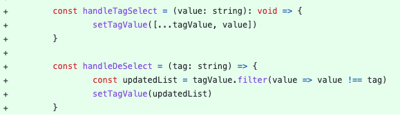

# Code Review

[https://github.com/ozkanonur/feednext/pull/91](https://github.com/ozkanonur/feednext/pull/91)

## Before code review
Before code review, I'll ask this developer to provide more context.
1. Why make these changes?
2. How to verify changes are run as expected?
3. If have unit test policy, will also ask to follow unit test policy.
4. I'll also ask to avoid large changes, the large changes will make it difficult to merge back to main branches.

## client/next.config.js

* async function not contain an await keyword, should confirm that, add await or remove async 

## client/src/@types/pages/create-feed/index.d.ts

* The `tags:string` will be confusing. It better change to "tagId": string or "tags": string[]. 

## client/src/pages/[feed]/index.tsx

* handleDeSelect not having return data should also add (): void => {...} 

## client/src/pages/index.tsx

* Didn't see "skipValueForPagination, tagFilter, sortBy, isLoading" use in useEffect, need more comment why make them as useEffect dependency.

* need take care tagFilter here, it's possible to get the wrong variable, could use "useCallback" to fix it. 

## client/src/services/api/Title/index.ts

* using the spread operator here will make it a little weird. Because username, tags, sortBy are all string types, I need more comments here. 

## server/package.json

* We could take a note, it's to avoid 0.12.0 breaking changes.
* CHANGELOG
   * https://github.com/typestack/class-validator/blob/6a5762196b06655d51dddfff7807a5a87fc12216/CHANGELOG.md

## server/src/v1/Title/Service/title.service.ts

* should remove async, and improve with sql batch update solution to speed performance.
* typeorm bulk update via raw query
   * https://stackoverflow.com/questions/53790994/bulk-update-via-raw-query-in-typeorm

## avoid use if single line.
The if single line statement easily makes errors, when you do copy and paste.
