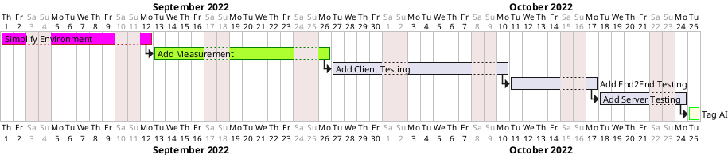
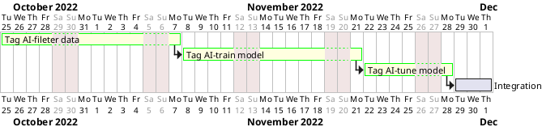

# Overview

## Review project
  * [feednext](https://github.com/ozkanonur/feednext)

## Propose top 1-3 initiatives
  * [Simplify Environment](simplify-env-001.md)
  * [Add Measurement](add-measurement-001.md) 
  * [Add Testing](add-testing-001.md) 

## Assignment
  * [Link](https://gist.github.com/WhiteHsu/6f490356f9b07a7fab13d1b8591e4672)
